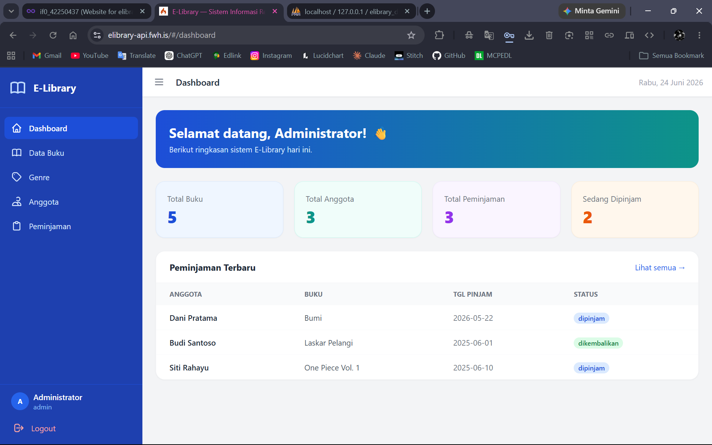
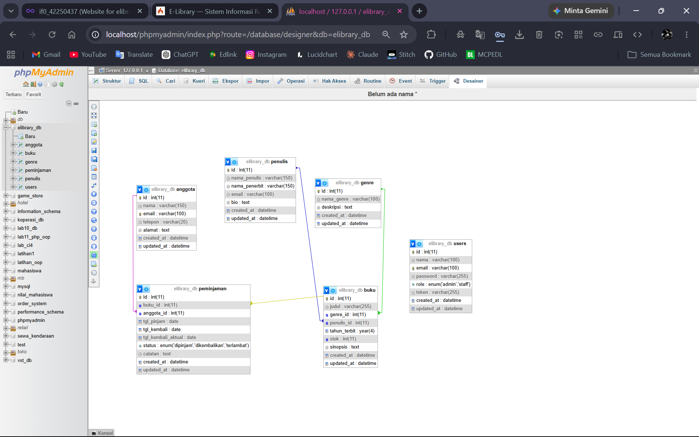
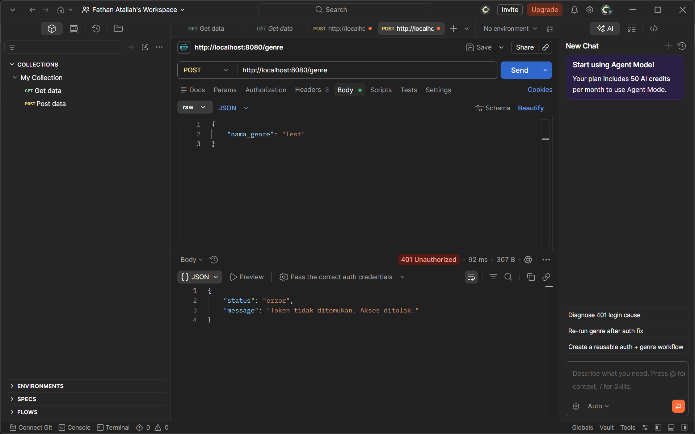
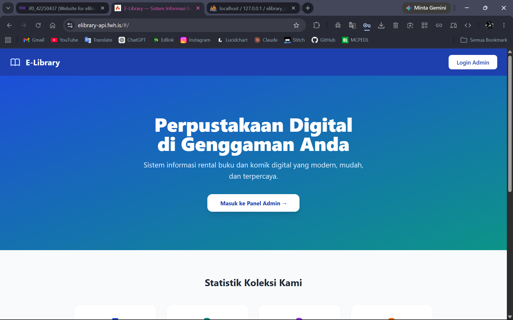
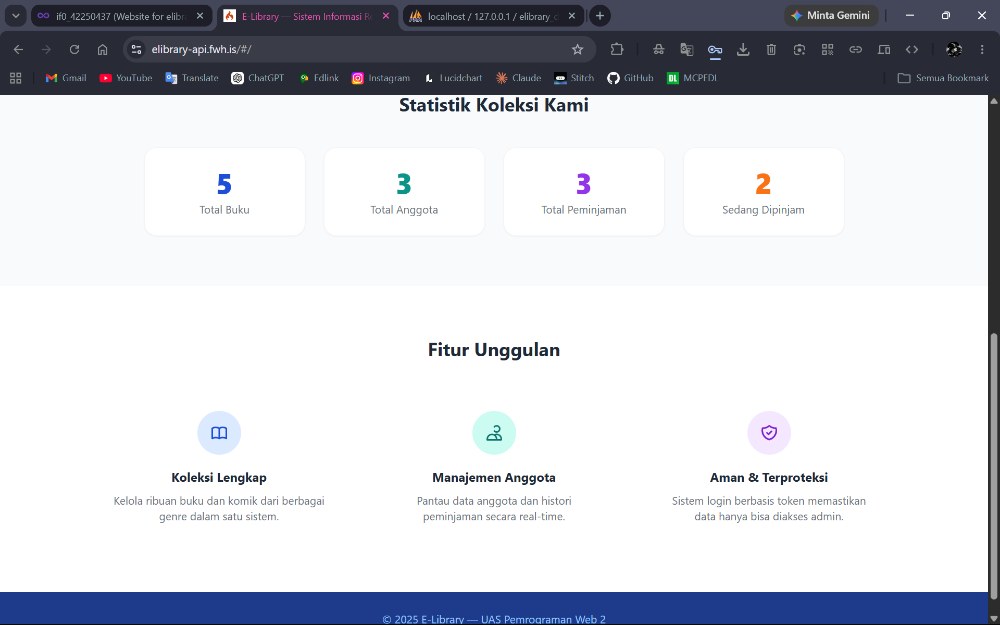
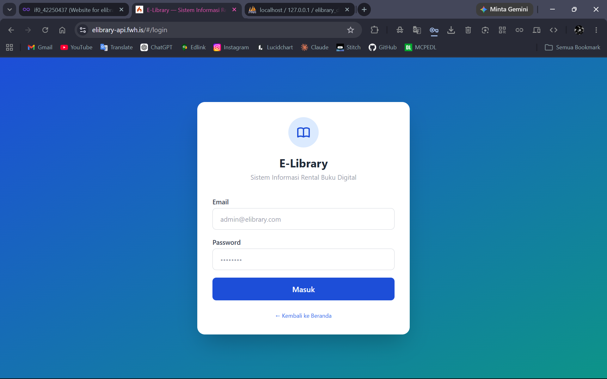
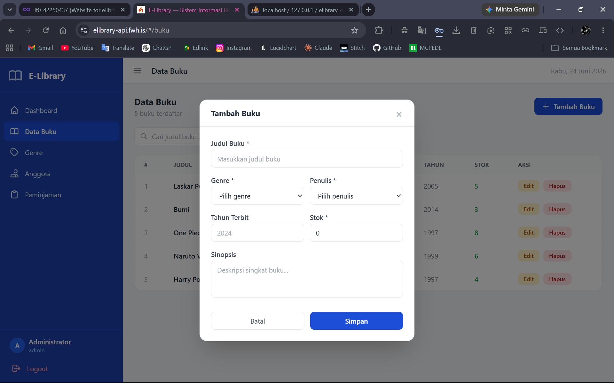
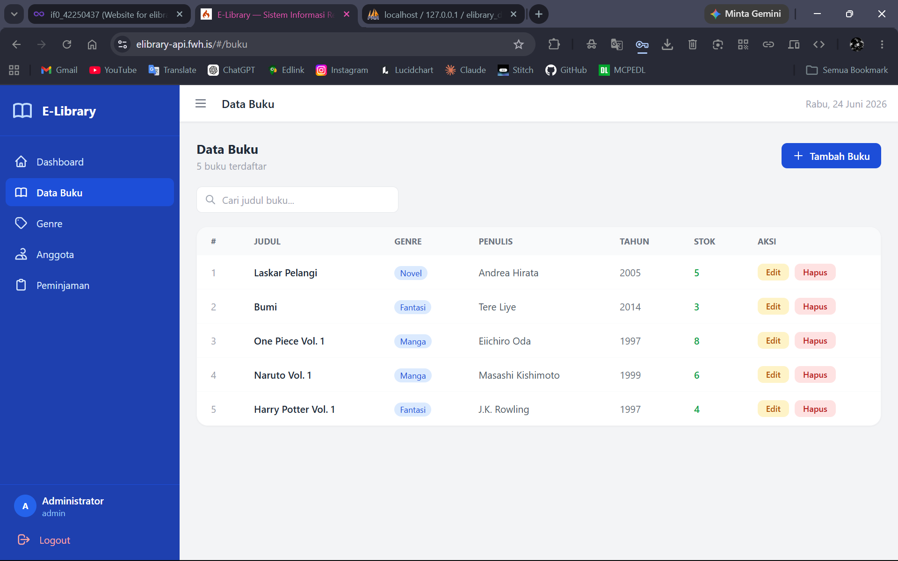
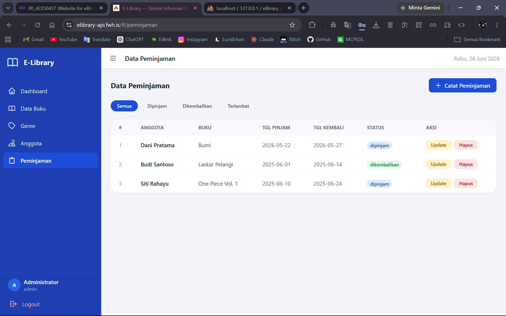

# E-Library — Sistem Informasi Rental Buku / Komik Digital

<div align="center">



**Proyek Ujian Akhir Semester — Pemrograman Web 2**

| | |
|---|---|
| **Nama** | Fathan Atallah Rasya Nugraha |
| **NIM** | 312410425 |
| **Mata Kuliah** | Pemrograman Web 2 |
| **Tema** | Sistem Informasi Rental Buku / Komik Digital |

[](https://elibrary-api.fwh.is/app.html)
[](https://youtu.be/[ID_VIDEO])
[](https://github.com/[USERNAME]/UAS_Web2_[NIM]_[NAMA])

</div>

---

## Deskripsi Proyek

**E-Library** adalah sistem informasi rental buku dan komik digital berbasis web yang dibangun menggunakan arsitektur **Decoupled (Terpisah)** — backend dan frontend sepenuhnya dipisah dan berkomunikasi melalui RESTful API.

Sistem ini memiliki dua jenis pengguna:
- **Pengunjung** — dapat melihat landing page dengan statistik koleksi secara publik
- **Administrator** — dapat mengelola seluruh data melalui panel admin yang terproteksi token

---

## Teknologi yang Digunakan

| Komponen | Teknologi |
|---|---|
| **Backend** | PHP CodeIgniter 4 (RESTful API / Resource Controller) |
| **Frontend** | Vue JS 3 via CDN (Single Page Application) |
| **UI Framework** | Tailwind CSS via CDN |
| **HTTP Client** | Axios |
| **Database** | MySQL / MariaDB |
| **Autentikasi** | Bearer Token (disimpan di localStorage) |
| **Hosting Backend** | InfinityFree (elibrary-api.fwh.is) |
| **Hosting Frontend** | InfinityFree (elibrary-api.fwh.is/app.html) |

---

## Struktur Folder

```
UAS_Web2_[NIM]_[NAMA]/
├── backend-api/                 → Framework CodeIgniter 4
│   └── app/
│       ├── Controllers/
│       │   ├── AuthController.php
│       │   ├── BukuController.php
│       │   ├── GenreController.php
│       │   ├── PenulisController.php
│       │   ├── AnggotaController.php
│       │   ├── PeminjamanController.php
│       │   └── DashboardController.php
│       ├── Models/
│       │   ├── UserModel.php
│       │   ├── BukuModel.php
│       │   ├── GenreModel.php
│       │   ├── PenulisModel.php
│       │   ├── AnggotaModel.php
│       │   └── PeminjamanModel.php
│       ├── Filters/
│       │   ├── AuthFilter.php    → Proteksi Bearer Token
│       │   └── CorsFilter.php    → Handle CORS
│       └── Config/
│           ├── Filters.php       → Daftarkan filter
│           └── Routes.php        → Semua endpoint API
├── frontend-spa/                → Aplikasi Vue JS SPA
│   ├── index.html               → Entry point (lokal)
│   └── component/
│       ├── api.js               → Axios + Interceptor
│       ├── router.js            → Vue Router + Guard
│       ├── app.js               → Inisialisasi Vue
│       ├── Home.js              → Landing page publik
│       ├── Login.js             → Halaman login
│       ├── Layout.js            → Sidebar + Topbar
│       ├── Dashboard.js         → Halaman dashboard
│       ├── Buku.js              → CRUD buku
│       ├── Genre.js             → CRUD genre
│       ├── Anggota.js           → CRUD anggota
│       └── Peminjaman.js        → CRUD peminjaman
└── elibrary_db.sql              → File database SQL
```

---

## Skema Relasi Database

> Screenshot skema relasi tabel dari phpMyAdmin Designer:



**Deskripsi Tabel:**

| Tabel | Fungsi | Relasi |
|---|---|---|
| `users` | Data administrator login | — |
| `genre` | Kategori buku (Novel, Komik, Manga, dll) | — |
| `penulis` | Data penulis dan penerbit | — |
| `buku` | Data koleksi buku | → `genre`, `penulis` |
| `anggota` | Data anggota / peminjam | — |
| `peminjaman` | Transaksi peminjaman buku | → `buku`, `anggota` |

---

## Uji Coba Proteksi Token (Error 401)

Endpoint manipulasi data (POST, PUT, DELETE) diproteksi menggunakan **CodeIgniter Filter** — hanya bisa diakses dengan Bearer Token yang valid.

> Screenshot uji coba POST `/genre` tanpa token via Postman:



**Response yang dikembalikan:**
```json
{
    "status": "error",
    "message": "Token tidak ditemukan. Akses ditolak."
}
```

---

## 📸 Screenshot Antarmuka Aplikasi

### Landing Page (Pengunjung)



### Halaman Login


### Dashboard Admin


### Form Modal Tambah / Edit Data


### Tabel Data Buku


### Tabel Data Peminjaman


---

## Fitur Aplikasi

### Pengunjung (Tanpa Login)
- Melihat landing page dengan statistik koleksi buku secara publik (total buku, anggota, peminjaman)

### Administrator (Wajib Login)
- Login dan logout dengan sistem token autentikasi
- Dashboard dengan statistik real-time dan tabel peminjaman terbaru
- CRUD Data Buku (tambah, lihat, edit, hapus + pencarian)
- CRUD Data Genre
- CRUD Data Anggota
- CRUD Data Peminjaman (dengan filter status: dipinjam / dikembalikan / terlambat)

### Keamanan
- **AuthFilter CI4** — proteksi endpoint POST/PUT/DELETE dengan Bearer Token
- **Navigation Guard Vue Router** — halaman admin tidak bisa diakses tanpa login
- **Axios Request Interceptor** — token otomatis disisipkan di setiap request
- **Axios Response Interceptor** — auto redirect ke login jika token expired (401)

---

## Petunjuk Instalasi di Komputer Lokal

### Prasyarat
- XAMPP (PHP 8.2+ dan MySQL)
- Composer
- Browser modern (Chrome / Firefox)

### 1. Clone Repository
```bash
git clone https://github.com/[USERNAME]/UAS_Web2_[NIM]_[NAMA].git
cd UAS_Web2_[NIM]_[NAMA]
```

### 2. Setup Backend
```bash
cd backend-api
composer install
cp env .env
```

Edit file `.env`:
```
CI_ENVIRONMENT = development

database.default.hostname = localhost
database.default.database = elibrary_db
database.default.username = root
database.default.password = 
database.default.DBDriver = MySQLi
database.default.port     = 3306
```

### 3. Import Database
Buka **phpMyAdmin** → Import file `elibrary_db.sql` dari root folder.

### 4. Jalankan Backend
```bash
php spark serve
```
Backend berjalan di `http://localhost:8080`

### 5. Jalankan Frontend
Akses via browser:
```
http://localhost/[NAMA_FOLDER]/frontend-spa/index.html
```

### 6. Login Admin
```
Email    : admin@elibrary.com
Password : password
```

---

## Link Demo dan Presentasi

| | Link |
|---|---|
| **Live Demo** | https://elibrary-api.fwh.is |
| **Video Presentasi** | https://youtu.be/[ID_VIDEO_YOUTUBE] |
